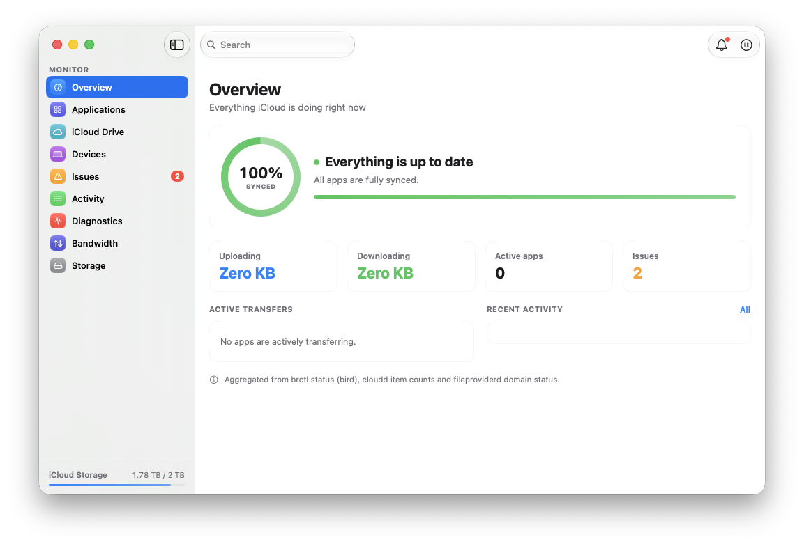

# Birdwatch

**See what iCloud is actually doing.** A native macOS utility that makes iCloud sync visible — per-app status, files in transit, issues explained in plain language, live daemon logs, diagnostics, storage, and estimated bandwidth — in a main window and a menu-bar popover.

Birdwatch is built on one rule: **it never invents a number.** Where macOS exposes real data, you get real data. Where it doesn't, the app says so and points you to the place that does.

<p align="center">
  
</p>

## What it shows

| Area | Where the data comes from |
|---|---|
| **Applications** | Real iCloud app containers enumerated from `~/Library/Mobile Documents` (with on-this-Mac footprint), CloudKit apps *observed* in `cloudd`'s unified log (an app appears only when it has actually synced), File Provider domains from `~/Library/CloudStorage`. |
| **Live transfers & activity** | FSEvents candidates probed with per-URL ubiquity resource values (`isUploading` / `isDownloading`). This channel is boolean-only, so in-flight items show an indeterminate bar — never a fabricated percentage. |
| **Issues** | File conflicts via `NSFileVersion` (resolved under `NSFileCoordinator`), quota warnings, stuck retry items, and bird's own health-report and account errors from `brctl dump`. |
| **Diagnostics** | Daemon CPU/memory (`ps`), sync-engine budgets and scheduler counts, the retry queue with real paths recovered from bird's redacted dump, and maintenance actions that actually work (daemon restart via SIGTERM + launchd respawn — `launchctl` is SIP-blocked). |
| **Storage** | Account usage derived from your plan cap minus `brctl quota` (matches System Settings), plus a file-type breakdown of your local iCloud Drive footprint. Per-service split (Photos/Messages/backups) is private to Apple and shown as one honest remainder. |
| **Bandwidth** | Estimated from `nettop` deltas per daemon pid; labeled as an estimate. |
| **Devices** | bird redacts device names permanently, so this is an honest anonymous view: how many devices have touched your Drive and when. |

The `operations/` notes under `.memory/` (if you use Memophant) and the code comments record every dead end we hit — `NSMetadataQuery` is silently empty without an iCloud entitlement, `brctl monitor` wraps that same dead query, `brctl status` blocks 15–28 s during active sync, and so on. Those findings are the most reusable part of this project.

## Requirements

- macOS 15 or later
- Xcode 16 / Swift 6.2 toolchain (built with `SWIFT_DEFAULT_ACTOR_ISOLATION = MainActor`, strict concurrency)
- [XcodeGen](https://github.com/yonaskolb/XcodeGen) (`brew install xcodegen`) — the `.xcodeproj` is generated from `project.yml`
- Birdwatch runs **outside the App Sandbox** and asks for **Full Disk Access**; that's what lets it read the sync daemons' state. Your files and sync data never leave your Mac; anonymous usage counts do (see [Privacy](site/privacy.html)), and Diagnostics has the switch to turn that off.

## Build

```bash
xcodegen generate
xcodebuild -project Birdwatch.xcodeproj -scheme Birdwatch -destination 'platform=macOS' build
```

To dogfood a decoupled dev copy (builds into isolated DerivedData and launches `~/Applications/Birdwatch-dev.app`):

```bash
scripts/build-detached.sh
```

Add `--mock` as a launch argument to run on the design-handoff fixture data instead of the live system.

To sign builds with your own team: `DEVELOPMENT_TEAM=<TEAMID> xcodegen generate`. Unsigned local builds work without it.

Usage analytics ([swift-stats](https://github.com/awizemann/swift-stats)) is off in local builds unless a write key is supplied at build time: `xcodebuild … BW_STATS_WRITE_KEY=<key> build` bakes it into the built Info.plist. The key is never committed and is not a project.yml setting (so `xcodegen generate` cannot capture it); `scripts/release.sh` requires it in the environment. `--mock` and test runs always run with analytics off.

## Test

```bash
xcodebuild -project Birdwatch.xcodeproj -scheme Birdwatch -destination 'platform=macOS' test
```

Swift Testing throughout. Parsers are pure functions tested against **real captured output** from the system tools (fixtures under `BirdwatchTests/Fixtures/`, sanitized); the store is tested with an injected clock and stub sources — no timing-dependent tests.

## Release

`scripts/release.sh` runs the full Developer ID pipeline: build-number bump → archive → codesign verify → notarize (App Store Connect API key or keychain profile) → staple → Gatekeeper assess. It needs `DEVELOPMENT_TEAM`, `SIGNING_IDENTITY`, and notary credentials in your environment; the script header explains each. Birdwatch is Developer-ID distributed — the Mac App Store requires sandboxing, which this app cannot use.

## Architecture in one paragraph

Views consume only Sendable value DTOs from a single `@Observable` `SyncStore`. A composite `SystemSyncSource` assembles each snapshot from actor-isolated sources (`brctl`, `ps`, `nettop`, `log show`, FSEvents) behind one `ProcessRunner` that never blocks the main actor, times out every tool, and drains pipes chunked. Expensive scans (conflicts, container sizes, the `brctl dump` parse, CloudKit log mining) run off the snapshot path in single-flight background tasks with TTL caches, so first paint never waits on them. The full six-specialist audit that shaped it is in [audits/](audits/).

## Contributing

Issues and pull requests are welcome. Please keep the honesty rule: if a backend can't provide a value, the UI must say so rather than estimate it silently. Every parser change should come with a fixture from real tool output and a test that fails on the old behavior.

## License

MIT — see [LICENSE](LICENSE).
